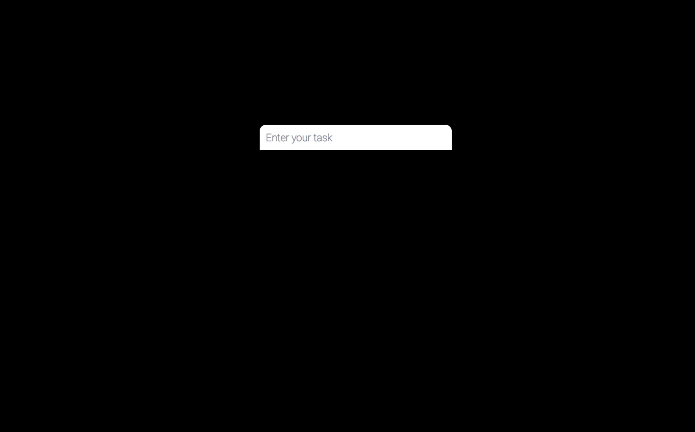
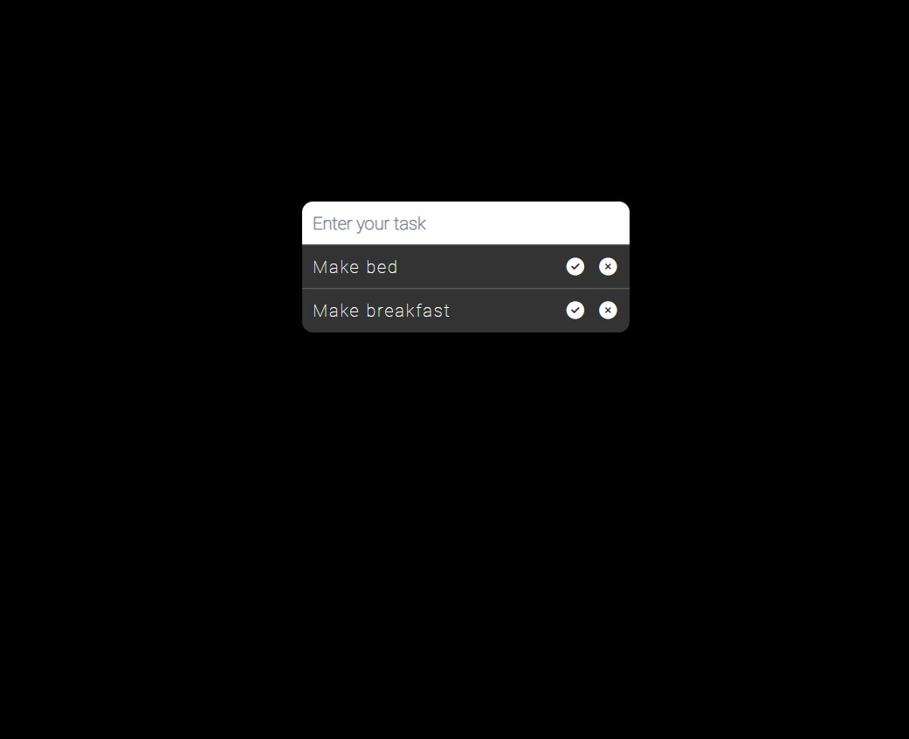
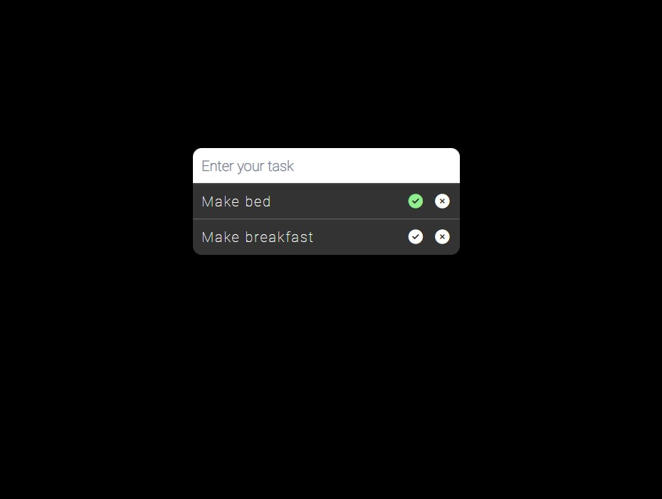
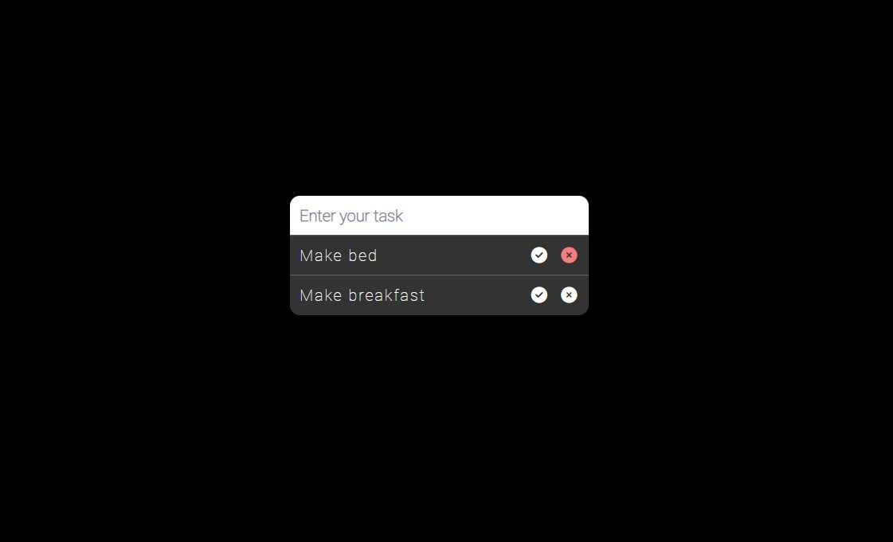
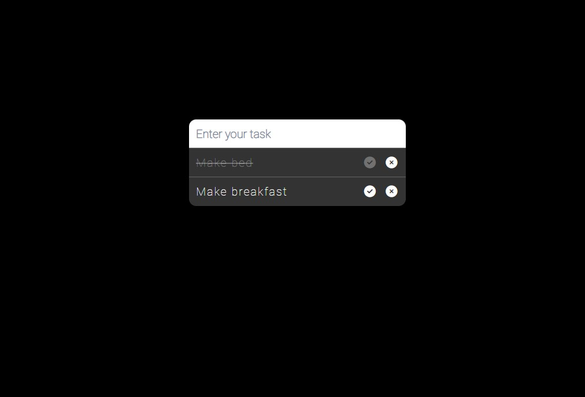
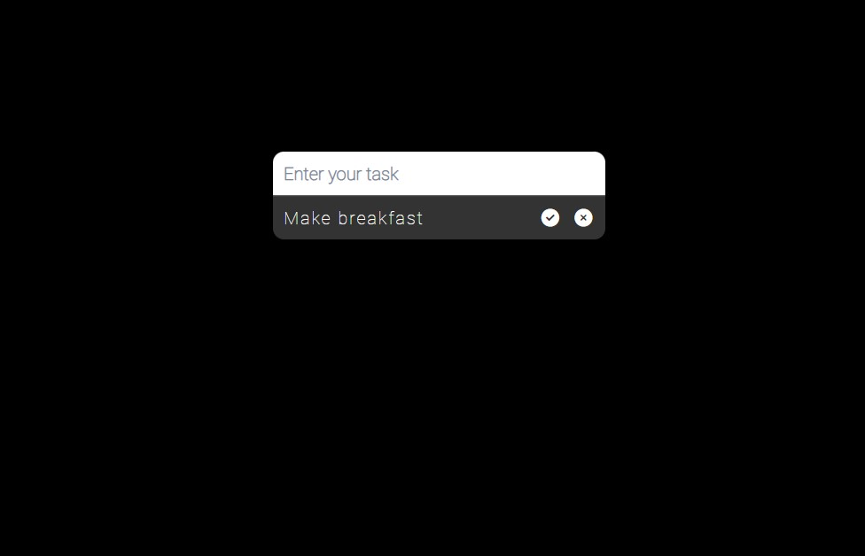

# [Live Demo](https://rusdiana97.github.io/to-do-list.github.io/)

# To Do List :pencil:

Plan your day with this *To Do List*.

*To Do List* is a personal project developed with HTML, CSS and Vanilla JavaScript in Visual Studio Code.

**Feel free to add a task, check it or delete it.**

*The website have a responsive design and I implement a localStorage for your data to be sure that you will have your tasks on the list even you closed the browser.*

Here is how you can use it:
- when you access the site, the list is empty

- in the input field, enter some task

- when you hover over the check icon, it's color will change to lightgreen

- when you hover over the check icon, it's color will change to lightcoral

- press the check icon for solve a task

- you can uncheck the task by pressing again the check icon

- press the delete icon for remove a task

