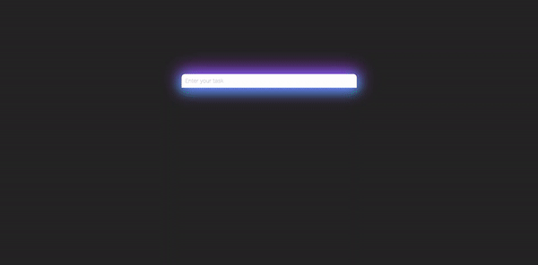

# [Live Demo](https://rusdiana97.github.io/to-do-list.github.io/)

# To Do List :pencil:

## 1. Project Description

Plan your day with this *To Do List*.

*To Do List* is a personal project developed with HTML, CSS and Vanilla JavaScript in Visual Studio Code.

On this website, you will find: 
- responsive web design
- localStorage property
- preloader animation
- add and check or delete a task
- CSS variables

**Feel free to add a task, check it or delete it.**

*I implement a localStorage for your data to be sure that you will have your tasks on the list even you closed the browser.*

## 2. How to Install / Run the Project

**To install / run the project, you have two choices:**
1. download the entire project on your computer from Code -> Download Zip and open the index.html file on your browser for running the project
2. click on [LIVE DEMO](https://rusdiana97.github.io/to-do-list.github.io/) for running the project on your browser (you won't download the project)

**I recommend you to see the [LIVE DEMO](https://rusdiana97.github.io/to-do-list.github.io/) of the project.**

**The website was tested functional and non-functional and works perfectly on the following browsers:**
- Mozilla Firefox
- Google Chrome
- Opera

**For testing the responsive web design I used the Responsive Design Mode from the Mozilla Firefox and it works perfectly so feel free to try the website on another device besides the computer or laptop.**

## 3. How to Use the Project

Steps:
- when you access the site, the list is empty
- in the input field, enter some task
- when you hover over the check icon or delete icon, it's color will change
- press the check icon for solve a task
- you can uncheck the task by pressing again the check icon
- press the delete icon for remove a task

See the following .gif with the steps above for a clearer understanding or see the [LIVE DEMO](https://rusdiana97.github.io/to-do-list.github.io/) of the project:

## 4. Credits
[Font Awesome](https://fontawesome.com)

